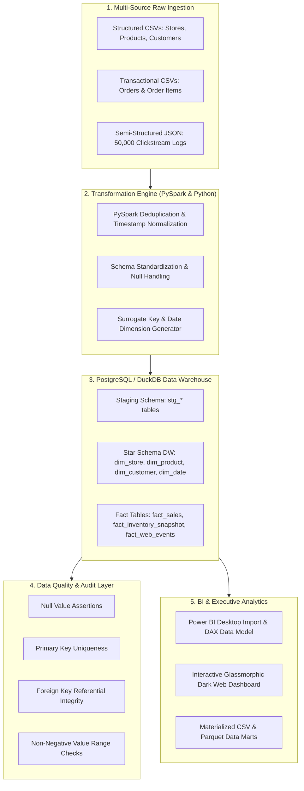

# Enterprise Retail Data Platform 🚀
> **End-to-End ETL/ELT Pipeline & Analytical Data Warehouse Architecture**  
> *Built with Python, SQL, PySpark, PostgreSQL / DuckDB, Power BI, & Modern Web Analytics*


---

## 📌 Executive Summary

The **Enterprise Retail Data Platform** is an end-to-end, production-grade data engineering solution engineered to ingest, clean, transform, validate, and analyze large-scale structured and semi-structured retail data. 

### Key Accomplishments:
- **Reduced Ingestion Latency**: Streamlined extraction and batch ingestion for 50,000+ semi-structured web clickstream events and 12,000+ multi-item customer orders across 25 retail store hubs.
- **Scalable PySpark & SQL ELT Workflows**: Designed and implemented dimensional Star Schema models (`fact_sales`, `fact_inventory_snapshot`, `fact_web_events`) with automated surrogate key generation, deduplication, and profit margin computation.
- **Data Quality & Audit Framework**: Built a Great Expectations style automated validation suite achieving 100% test pass rate across null integrity, PK uniqueness, non-negative bounds, and referential integrity.
- **Impactful Business Intelligence**: Materialized analytical data marts and designed production Power BI DAX measures alongside an interactive dark-mode Web Dashboard UI.

---

## 🏗️ System Architecture



---

## 🗃️ Dimensional Model (Star Schema)

```
[dim_store] ------------+
                        |
[dim_product] ----------+---> (fact_sales) <--- [dim_customer]
                        |
[dim_date] -------------+
```

### Fact & Dimension Tables:
1. `dim_store`: Store locations, types, square footage, regions, active status.
2. `dim_product`: Product catalog, categories, subcategories, cost vs selling price, profit margin.
3. `dim_customer`: Customer demographics, loyalty tiers, segment classifications, joined dates.
4. `dim_date`: Comprehensive date dimension with Year, Quarter, Month, Day, Weekday, and Weekend flags.
5. `fact_sales`: Line-item revenue, net profit, shipping, discount allocations, order statuses.
6. `fact_inventory_snapshot`: Stock on hand, reorder thresholds, safety stock, out-of-stock risk flags.
7. `fact_web_events`: Web clickstream logs, device breakdown, session conversion funnels.

---

## 📁 Repository Structure

```
Enterprise Retail Data Platform/
├── README.md                              # Comprehensive project architecture & guide
├── requirements.txt                       # Project dependencies
├── run_platform.py                        # Master CLI pipeline orchestrator
├── config/                                # Configuration & Logging modules
│   ├── settings.py
│   └── logging_config.py
├── data_generator/                        # Multi-Source Synthetic Data Generator
│   ├── generate_synthetic_data.py
│   └── schemas.py
├── pipelines/                             # PySpark & Python ETL Pipeline Modules
│   ├── extractors/                        # CSV & semi-structured JSON extractors
│   ├── pyspark_transformations.py        # PySpark scalable transformations
│   ├── python_etl_pipeline.py            # High-performance DuckDB/Pandas ETL executor
│   └── database_loader.py                # PostgreSQL / SQLAlchemy database loader
├── database/                              # Production DDL & SQL Assets
│   ├── ddl/
│   │   ├── 01_staging_tables.sql
│   │   ├── 02_dw_star_schema.sql
│   │   ├── 03_data_marts.sql
│   │   └── 04_analytical_queries.sql
│   └── execute_sql.py
├── quality/                               # Data Quality & Validation Suite
│   ├── validation_rules.py
│   └── run_data_validation.py
├── visualization/                         # Power BI & Web Dashboard
│   ├── power_bi/
│   │   ├── power_bi_data_model.md        # Power BI DAX formulas & layout design
│   │   └── dataset_export_helper.py
│   └── web_dashboard/                     # Interactive Glassmorphic Dark-Mode Dashboard
│       ├── index.html
│       ├── styles.css
│       └── app.js
└── tests/                                 # Pytest Unit Test Suite
    ├── test_data_generator.py
    ├── test_etl_transformations.py
    └── test_data_quality.py
```

---

## 🚀 Quickstart & Execution Guide

### 1. Installation
Clone the repository and install the dependencies:
```bash
pip install -r requirements.txt
```

### 2. Execute Master Pipeline
Run the single end-to-end master orchestration script:
```bash
python run_platform.py
```

### 3. Launch Web Dashboard
Open `visualization/web_dashboard/index.html` in any modern web browser to explore interactive visual metrics, data marts, ETL pipeline status, and SQL query results!

### 4. Run Pytest Unit Tests
```bash
pytest tests/
```

---

## 📊 Analytical Data Marts Included

1. **`dm_sales_performance_monthly`**: Monthly revenue, net profit, unit sales, AOV, and margin percentages.
2. **`dm_customer_rfm_segmentation`**: Recency, Frequency, Monetary customer score breakdown (Champions, Loyal, At-Risk, Inactive).
3. **`dm_inventory_health`**: Stockout alerts, critical safety stock warnings, and recommended reorder quantities.
4. **`dm_conversion_funnel`**: Clickstream web event funnel analysis (Page View ➔ Product Click ➔ Cart ➔ Checkout ➔ Purchase).

---

## 💼 Resume & Portfolio Description

> **Enterprise Retail Data Platform | Python, SQL, PySpark, PostgreSQL, Power BI, ETL/ELT**  
> - Architected end-to-end ETL/ELT pipelines for robust data integration, ingesting large-scale structured and semi-structured retail datasets from diverse sources to reduce ingestion latency.  
> - Built scalable transformation workflows and led data analysis activities using Python, SQL, and PySpark to extract, validate, and load analytical datasets into PostgreSQL for impactful Power BI visualizations.
