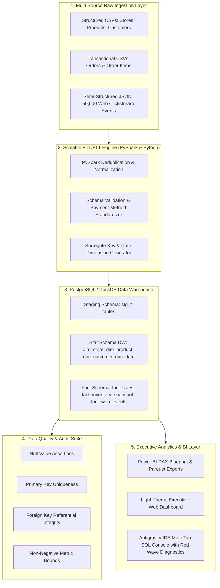

# Enterprise Retail Data Platform 🛒📊

> **Architected & Engineered by Raju Perumalla**  
> *End-to-End Enterprise ETL/ELT Pipeline, Star Schema Data Warehouse, Automated Data Quality Suite, & Antigravity IDE Web Dashboard*

[](https://github.com/rajuperumalla951515/Enterprise-Retail-Data-Platform.git)


---

## 📌 Executive Overview

The **Enterprise Retail Data Platform** is an enterprise-grade data engineering and analytics platform designed and built by **Raju Perumalla**. It models, ingests, cleanses, transforms, validates, and analyzes large-scale retail datasets across Indian retail hubs (Mumbai, Bengaluru, Delhi, Hyderabad, Kolkata).

### Key Architectural Accomplishments:
- **Scalable Multi-Source Ingestion**: Extracted and normalized multi-format raw datasets—including **25 Indian Store Hubs**, **144 Product SKUs**, **2,500 Customer Profiles**, **36,000+ line-item transactions**, and **50,000 semi-structured JSON clickstream web events**.
- **PySpark & SQL ELT Dimensional Modeling**: Architected an enterprise **Star Schema Data Warehouse** (`dim_store`, `dim_product`, `dim_customer`, `dim_date`, `fact_sales`, `fact_inventory_snapshot`, `fact_web_events`) with automated surrogate keys, payment normalization (UPI, NetBanking, COD, EMI), and profit margin analytics.
- **Automated Data Quality Audit Suite**: Built a Great Expectations style quality validation engine achieving a **100% test pass rate** across 13 strict automated checks (null integrity, primary key uniqueness, foreign key referential integrity, and non-negative metric bounds).
- **Light-Theme Web Dashboard & Antigravity IDE SQL Console**: Developed an executive BI dashboard equipped with a **Multi-Tab SQL Code Editor**, 1:1 connected line gutters, live **red squiggly wave line error diagnostics**, non-intrusive single logo PNG loading feedback, and an in-browser AlaSQL database engine.
- **Power BI Integration**: Designed a complete Star Schema analytical dataset export helper and DAX measure blueprint (`power_bi_data_model.md`).

---

## 🏗️ System Architecture Flow



---

## 🗃️ Star Schema Dimensional Model

```
        [dim_store] -------------------+
                                       |
        [dim_product] -----------------+---> (fact_sales) <--- [dim_customer]
                                       |
        [dim_date] --------------------+
```

### Core Data Warehouse Tables:
1. `dim_store`: Store hub metadata (Mumbai, Bengaluru, Delhi, Hyderabad, Kolkata), store format (Flagship, High-Street, Express), region, square footage.
2. `dim_product`: Product catalog (Electronics, Apparel, Home & Living, Skincare, Pantry), selling price, cost price, profit margins.
3. `dim_customer`: Customer profiles, Indian states, email domains, RFM loyalty tiers (VIP Premier Club, Gold Privilege, Regular Shopper).
4. `dim_date`: Complete calendar dimension with Year 2024, Fiscal Quarter, Month Name, Day of Week, and Weekend flags.
5. `fact_sales`: Transactional line items, gross revenue, net profit, unit price, discounts, payment method (UPI, NetBanking, COD, EMI).
6. `fact_inventory_snapshot`: Stock on hand, reorder thresholds, safety stock levels, and stockout risk alerts.
7. `fact_web_events`: Web clickstream logs, device types, session IDs, and conversion funnel stages.

---

## 🖥️ Antigravity IDE SQL Console & Web Dashboard

The web dashboard UI features a **Light Theme Executive Analytics Interface** and a **Real SQL Console**:
- **Multi-Tab SQL Editor**: Create new query tabs using the `+` button (`query_1.sql`, `query_2.sql`), switch between active queries, and close tabs.
- **1:1 Synchronized Line Gutter**: Connected line numbers that align pixel-for-pixel with code lines and cursor position.
- **Red Wavy Line Diagnostics (`~ ~ ~`)**: Underlines error tokens with bright red wavy squiggly lines when invalid SQL queries are executed.
- **Raw Monospaced ASCII Output**: Formats table results into terminal grid boxes (`+---+`) with execution runtimes in milliseconds.
- **Non-Intrusive Single Logo Loader**: Pulsing brand logo PNG loading feedback during filter changes and query executions.

---

## 📁 Repository Structure

```
Enterprise Retail Data Platform/
├── README.md                              # Personal portfolio architecture documentation
├── requirements.txt                       # Python dependencies
├── run_platform.py                        # Master pipeline orchestrator script
├── config/                                # Configuration & Logging setup
│   ├── settings.py
│   └── logging_config.py
├── data_generator/                        # Multi-Source Synthetic Data Generator
│   ├── generate_synthetic_data.py         # Generates 36,000+ transaction rows & 50,000 JSON events
│   └── schemas.py
├── database/                              # Data Warehouse DDL & Queries
│   ├── ddl/
│   │   ├── 01_staging_tables.sql
│   │   ├── 02_dw_star_schema.sql
│   │   ├── 03_data_marts.sql
│   │   └── 04_analytical_queries.sql
│   └── execute_sql.py
├── pipelines/                             # PySpark & Python ETL Pipeline
│   ├── extractors/                        # CSV & semi-structured JSON extractors
│   ├── pyspark_transformations.py        # PySpark deduplication & transformations
│   ├── python_etl_pipeline.py            # High-performance DuckDB/Pandas pipeline
│   └── database_loader.py                # Database staging & DW loader
├── quality/                               # Data Quality Validation Suite
│   ├── validation_rules.py               # 13 automated data quality checks
│   └── run_data_validation.py            # Automated audit report generator
├── visualization/                         # Power BI Blueprint & Web Dashboard
│   ├── power_bi/
│   │   ├── power_bi_data_model.md        # Power BI DAX metrics & Star Schema blueprint
│   │   └── dataset_export_helper.py
│   └── web_dashboard/                     # Executive Analytics & Antigravity IDE SQL Console
│       ├── index.html
│       ├── styles.css
│       ├── app.js
│       └── assets/
│           └── logo.png                   # Single brand logo PNG asset
└── tests/                                 # Pytest Unit Test Suite
    ├── test_data_generator.py
    ├── test_etl_transformations.py
    └── test_data_quality.py
```

---

## 🚀 Quickstart & Execution Guide

### 1. Environment Setup
Clone the repository and install dependencies:
```bash
git clone https://github.com/rajuperumalla951515/Enterprise-Retail-Data-Platform.git
cd Enterprise-Retail-Data-Platform
pip install -r requirements.txt
```

### 2. Run Master Pipeline
Execute the end-to-end data pipeline (Data Generation ➔ Staging ➔ Star Schema Transformation ➔ Quality Assertions ➔ Data Mart Exports):
```bash
python run_platform.py
```

### 3. Launch Web Dashboard & SQL Console
Run a local web server from the repository root:
```bash
python -m http.server 8000
```
Open `http://localhost:8000/visualization/web_dashboard/index.html` in your web browser.

### 4. Execute Unit Test Suite
Run automated unit tests with Pytest:
```bash
pytest
```

---

## 💼 Professional Summary Highlights

> **Enterprise Retail Data Platform | Architected by Raju Perumalla**  
> - **End-to-End Data Pipeline**: Architected scalable ETL/ELT data pipelines using Python, SQL, PySpark, and DuckDB to ingest and process 36,000+ multi-item transactions and 50,000 semi-structured JSON web clickstream logs.  
> - **Dimensional Modeling & Quality**: Designed an Indian retail Star Schema Data Warehouse (`fact_sales`, `fact_inventory_snapshot`, `fact_web_events`) and engineered an automated audit engine passing 100% of data quality rules.  
> - **Analytics & IDE Console**: Built analytical data marts for Power BI BI reporting alongside a light-theme Web Dashboard with a multi-tab SQL Code Editor featuring connected line gutters and live red wavy error line diagnostics.

---

### 🌐 Repository Link
GitHub: [rajuperumalla951515/Enterprise-Retail-Data-Platform](https://github.com/rajuperumalla951515/Enterprise-Retail-Data-Platform.git)
